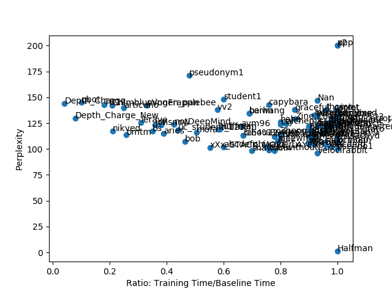

# TTIC_Deep_Learning_2018_Pareto_Competition

Lei Mao

University of Chicago


## Introduction

The 2018 Fundamentals of Deep Learning (TTIC 31230) course at the Toyota Technological Institute at Chicago hosted a "[Pareto](https://en.wikipedia.org/wiki/Pareto_efficiency)" language modeling competition on Penn TreeBank dataset. Every participant submits one pareto training point containing the time ratio of your own model and the benchmark, and the validatoin perplexity. Anyone whose pareto point sits on the pareto curve is considered to be the "winner".

Training language model is often slow if the language corpus is large. This is because ordinary model uses softmax to calculate the probability distribution of the output word. It has to sum up for all the word in order to normalize probability. If the corpus size is extremely large, say one billion, calculating this sum could often dominate the program calculation time. To approximate calculating the output word probability, there are generally two strategies: sampling based softmax and hierarchical softmax. In this project, I implemented sampled softmax and two-layer hierarchical softmax in particular in PyTorch, trying to improve the training efficiency and performance of the training of language model on Penn TreeBank dataset (corpus size: 10,000).

## Implementation of Sampled Softmax

Unlike TensorFlow and Theano, PyTorch does not provide a lot of softmax alternatives to the users. So I decided to implement a PyTorch version of the sampled softmax [1,2] in TensorFlow. (I will open-source the PyTorch version of the sampled softmax on my [GitHub](https://github.com/leimao/Sampled_Softmax_PyTorch) after this competition) The sampling process was coded using Numpy, which turned out to be surprisingly quite efficient (< 5% of the training time per batch). However, the performance of this sampled softmax on the training of the model on Penn Tree Bank dataset remained to be further explored or discussed. For sampling 200 words per batch, it took 40-50% of the time of using full softmax. The validation perplexity could fastly go below 200, but often stay around 135 and never go down further. Probably more sophisticated parameter tuning (grid search) and using pre-trained word embeddings could help, but I just did not try them.

So finally I did not pursue using sampled softmax further.

## Implementation of Hierarchical Softmax

Because Penn Tree Bank dataset is relatively small. I decided to implement a simple two-layer hierarchical softmax [3]. This two-layer hierarchical softmax has been implemented in Theano, so I checked the [source code](http://deeplearning.net/software/theano/library/tensor/nnet/nnet.html#theano.tensor.nnet.h_softmax) and reimplemented it using PyTorch. I did not use pre-trained word embeddings, or try to cluster and relabel the words before or during the training. However, in principle, these could improve the performance, which are worth trying in the future. Despite these, the model was still trained extremely efficiently and very well. The training of one epoch is extremely fast and the validation perplexity goes below 150 after one single epoch. 

So I pursued this two-layer hierarchical softmax for my model.

## Dependencies

Python 3.5

PyTorch 0.30

Numpy

## File Submission

```
.
├── check_paretopoint.py
├── data
│   └── ptb
│       ├── test.txt
│       ├── train.txt
│       └── valid.txt
├── data.py
├── generated.txt
├── generate_hsoftmax.py
├── generate.py
├── LICENSE.md
├── main.py
├── model.pt
├── model.py
├── paretopoint.json
├── paretopoint.png
└── README.md
```

The ``main.py``, ``model.py``, and ``model.pt`` were submitted via the script. The ``README.md`` and ``generate_hsoftmax.py`` could be downloaded from my Canvas.

## Key Features of the Model

Two-layer hierarchical softmax - Extremely fast

Adagrad Optimizer - Improve perplexity

## Shortcomings of the Model

The two-layer hierarchical softmax is designed to be used for this competition specifically given the corpus size of Penn Treebank dataset is not large and the specialty of "pareto" winner rule. Although my model was trained extremely fast and the first several validation perplexity from the first epochs looks great. In the long-term training, the perplexity would not likely go down. As a result, the validation perplexity after long-term training is not appealing (The state-of-art perplexity of models on Penn TreeBank dataset is around 60-80). This is because I did not cluster the words in rational way. In my model, due to short of time, Word 1 to 100 are simply labeled as class 1, word 101 to 200 are simply labeled as class 2, and so on. However, it does not make sense to have word 1 to 100 be in the same class. This probably limited the long-term training performance of the model. To improve the model in the future, please check the **Future Improvements** below.

## Model Training

To train the model using my hyperparameter settings:

```bash
python main.py --log_interval 200 --lr 0.1 --nhid 150 --nlayer 1 --epochs 5 --dropout 0 --model GRU --bptt 12 --batch_size 128 --seed 110
```

The training result on single-core CPU:

```
| epoch   1 |   200/  605 batches | lr 0.10 | ms/batch 228.70 | loss  6.05 | perplexity   423.82
| epoch   1 |   400/  605 batches | lr 0.10 | ms/batch 200.08 | loss  5.08 | perplexity   160.35
| epoch   1 |   600/  605 batches | lr 0.10 | ms/batch 195.75 | loss  4.90 | perplexity   134.31
-----------------------------------------------------------------------------------------
| end of epoch   1 | time: 129.48s | valid loss  4.97 | valid perplexity   143.79
-----------------------------------------------------------------------------------------
| epoch   2 |   200/  605 batches | lr 0.10 | ms/batch 190.06 | loss  4.77 | perplexity   117.85
| epoch   2 |   400/  605 batches | lr 0.10 | ms/batch 190.08 | loss  4.61 | perplexity   100.86
| epoch   2 |   600/  605 batches | lr 0.10 | ms/batch 188.95 | loss  4.55 | perplexity    94.38
-----------------------------------------------------------------------------------------
| end of epoch   2 | time: 118.26s | valid loss  4.87 | valid perplexity   129.87
-----------------------------------------------------------------------------------------
| epoch   3 |   200/  605 batches | lr 0.10 | ms/batch 189.51 | loss  4.52 | perplexity    92.00
| epoch   3 |   400/  605 batches | lr 0.10 | ms/batch 188.86 | loss  4.42 | perplexity    82.74
| epoch   3 |   600/  605 batches | lr 0.10 | ms/batch 189.52 | loss  4.37 | perplexity    78.85
-----------------------------------------------------------------------------------------
| end of epoch   3 | time: 118.05s | valid loss  4.84 | valid perplexity   125.87
-----------------------------------------------------------------------------------------
| epoch   4 |   200/  605 batches | lr 0.10 | ms/batch 190.62 | loss  4.37 | perplexity    79.10
| epoch   4 |   400/  605 batches | lr 0.10 | ms/batch 189.51 | loss  4.29 | perplexity    72.82
| epoch   4 |   600/  605 batches | lr 0.10 | ms/batch 189.46 | loss  4.25 | perplexity    70.25
-----------------------------------------------------------------------------------------
| end of epoch   4 | time: 118.36s | valid loss  4.83 | valid perplexity   125.37
-----------------------------------------------------------------------------------------
| epoch   5 |   200/  605 batches | lr 0.10 | ms/batch 190.91 | loss  4.27 | perplexity    71.59
| epoch   5 |   400/  605 batches | lr 0.10 | ms/batch 188.86 | loss  4.20 | perplexity    66.79
| epoch   5 |   600/  605 batches | lr 0.10 | ms/batch 189.74 | loss  4.17 | perplexity    64.81
-----------------------------------------------------------------------------------------
| end of epoch   5 | time: 118.34s | valid loss  4.84 | valid perplexity   126.11
-----------------------------------------------------------------------------------------
=========================================================================================
| End of training | test loss  4.79 | test perplexity   120.41
=========================================================================================
```

By the way, to restrict the usage of CPU to single core for PyTorch in Linux environment, please add the following into the ``~/.bashrc``:

```
# OpenMP
# Restrict the number of threads used in OpenMP to 1
export OMP_NUM_THREADS=1
```

Please also remember to refresh the ``~/.bashrc`` by:

```bash
source ~/.bashrc
```

## Pareto Point

The training time of 5 epochs of the benchmark model is 3135 seconds. The pareto points submitted are required to have time ratio less than 1.0 and validation perplexity less than 150.

The benchmark training result on single-core CPU:

```
| epoch   1 |   200/  829 batches | lr 20.00 | ms/batch 761.95 | loss  6.78 | perplexity   879.99
| epoch   1 |   400/  829 batches | lr 20.00 | ms/batch 748.36 | loss  6.06 | perplexity   427.56
| epoch   1 |   600/  829 batches | lr 20.00 | ms/batch 749.76 | loss  5.73 | perplexity   309.23
| epoch   1 |   800/  829 batches | lr 20.00 | ms/batch 745.29 | loss  5.60 | perplexity   270.95
-----------------------------------------------------------------------------------------
| end of epoch   1 | time: 642.69s | valid loss  5.44 | valid perplexity   230.49
-----------------------------------------------------------------------------------------
| epoch   2 |   200/  829 batches | lr 20.00 | ms/batch 729.22 | loss  5.47 | perplexity   238.62
| epoch   2 |   400/  829 batches | lr 20.00 | ms/batch 725.90 | loss  5.35 | perplexity   211.30
| epoch   2 |   600/  829 batches | lr 20.00 | ms/batch 725.81 | loss  5.21 | perplexity   183.89
| epoch   2 |   800/  829 batches | lr 20.00 | ms/batch 725.61 | loss  5.21 | perplexity   183.10
-----------------------------------------------------------------------------------------
| end of epoch   2 | time: 622.85s | valid loss  5.15 | valid perplexity   172.93
-----------------------------------------------------------------------------------------
| epoch   3 |   200/  829 batches | lr 20.00 | ms/batch 730.06 | loss  5.16 | perplexity   173.75
| epoch   3 |   400/  829 batches | lr 20.00 | ms/batch 725.20 | loss  5.11 | perplexity   164.99
| epoch   3 |   600/  829 batches | lr 20.00 | ms/batch 726.02 | loss  4.98 | perplexity   145.69
| epoch   3 |   800/  829 batches | lr 20.00 | ms/batch 726.86 | loss  5.01 | perplexity   150.46
-----------------------------------------------------------------------------------------
| end of epoch   3 | time: 623.25s | valid loss  5.01 | valid perplexity   150.54
-----------------------------------------------------------------------------------------
| epoch   4 |   200/  829 batches | lr 20.00 | ms/batch 729.05 | loss  4.99 | perplexity   146.53
| epoch   4 |   400/  829 batches | lr 20.00 | ms/batch 725.91 | loss  4.96 | perplexity   142.07
| epoch   4 |   600/  829 batches | lr 20.00 | ms/batch 725.98 | loss  4.83 | perplexity   125.74
| epoch   4 |   800/  829 batches | lr 20.00 | ms/batch 726.22 | loss  4.89 | perplexity   132.56
-----------------------------------------------------------------------------------------
| end of epoch   4 | time: 623.16s | valid loss  4.92 | valid perplexity   137.62
-----------------------------------------------------------------------------------------
| epoch   5 |   200/  829 batches | lr 20.00 | ms/batch 729.83 | loss  4.87 | perplexity   130.29
| epoch   5 |   400/  829 batches | lr 20.00 | ms/batch 726.54 | loss  4.85 | perplexity   127.80
| epoch   5 |   600/  829 batches | lr 20.00 | ms/batch 726.17 | loss  4.73 | perplexity   113.65
| epoch   5 |   800/  829 batches | lr 20.00 | ms/batch 725.50 | loss  4.79 | perplexity   120.75
-----------------------------------------------------------------------------------------
| end of epoch   5 | time: 623.24s | valid loss  4.87 | valid perplexity   130.51
-----------------------------------------------------------------------------------------
=========================================================================================
| End of training | test loss  4.84 | test perplexity   126.75
=========================================================================================
```


I focused on optimizing the model such that it reaches the validation perplexity of 150 as soon as possible. So I am submitting the validation perplexity after the first epoch (the first epoch only takes 129 seconds), which is (143.79, 0.041). It should be noted that the validation perplexity after the second epoch is 129.87. The pareto point will be (129.87, 0.079), which is also quite competitive.

Sometimes, on different machines, the validation perplexity may range from 135 to 170. But in most cases, after the first two epoch, the validation perplecity is less than 150.

If the validation perplexity after the first epoch is more than 150, please try to adjust the parameters a little bit. For example, changing the seed (please try first), batch_size (32, 64, 128), bptt (8, 10, 12), nhid (100, 128, 150). There is often good chance that the validation perplexity is less than 150 right after the first epoch. 

My model is extremely fast regarding training one epoch while retaining good validation perplexity. I have not systematically tuned the parameters for long-term training to minimize the validation perplexity.

## Sample Essay

To generate a random sample essay:

```bash
python generate_hsoftmax.py
```

It should be noted that the original ``generate.py`` is not useful for the model using hierarchical softmax. I modified ``generate.py`` to ``generate_hsoftmax.py`` so that it can generate a sample essay.

```
mae 's british electronics and environmental health and activities law of money <eos> the bonn plan calls proponents in the
customer through the strategy of the ongoing agreement to see the <unk> emergency and agreements <eos> the house expected panel
use much regrets of negotiations that the u.s. was stopped by <unk> it is n't <unk> <eos> next next october
the labor department said it would take an item in <unk> operation to additional N or $ N for the
face value of $ N a share for decades <eos> if june N had more than N days such as
top police execution vehicle u.s. abortion <eos> <unk> cutler was asked not to be assistant tobacco campaign <eos> in germany
for rome friday hint had <unk> as a labor department of running away from only N <unk> st. louis <unk>
cohen and <unk> <unk> a more commuters used to <unk> five of soda lewis <unk> had been told to any
congressional relations <eos> for years may reverse the nomination <eos> but mr. b. harrison also referred to the p.m. leader
did n't be completed by penn air <eos> and he wrote his office judge greenspan may understand his trip at
an antitrust case of the government and regulation <eos> now already as visible but more <unk> supporting markets and whole
legislatures <eos> with declaring the foster builds he ca n't be made <eos> wrap a satisfaction is <unk> so in
another time when opposition banning song in court <eos> in what attended us allow the board at seats on the
won he made a sure to make <unk> and taiwan those technology was that the <unk> that had a $
N in N americans and ca n't anxiety about $ N an emergency and drug peak <eos> also followed the
plant by april N of the people male child <eos> but any conservative and wo n't help democrat sherwin with
his broker to judge the coleman 's state program trading for lunch N local <unk> <unk> political changes in the
hands pursued looks standards to the republican from the window of the washington district of several years while the <unk>
N <unk> the shoulder from a price of iran 's economic and <unk> <unk> <unk> <eos> we involved sure that
all thing was able to get <unk> the strong suspension benefits more that some rout of their european businesses <eos>
the financial research and committee voted to j. <unk> of the bush pension funds and worries former prisoner 's unemployment
rates to win N N of the government since N N of N <eos> the same rate in fiscal N
home <unk> the thurmond suspension $ N in hawaii and N currently N vacant rates for $ N billion in
august and mortgage association first federal university south community grew off N to N last week came up from six
banks for discontinued <eos> the administration committee approved a program on oct. N N before u.s. inflation cases that leads
one day to contain a ford economy <eos> we 're serious press a attention to u.s. new jersey which budget
will be weakened for the world market <eos> congress has taken payments worried there by japan not to the gm
and some banks <eos> yet still that could bid for delivery of the <unk> citizen renewed fed perestroika before india
's march N <eos> the labor agreement meeting every week in august N after nov. seven of the october 's
index dropped N N to N billion yen from $ N billion in annual appropriations bills on jan. N and
<unk> in shaw for soviet union the <unk> homeowners the affiliate of the monetary by a full of the scheduled
lead to november N <eos> london which protesters south germany may socialist only the new program-trading body there japan surged
over the weekend <eos> but head nicholas european builders hold brussels and canadian government 's rule plans to be sold
into the country <eos> in july 's july N million collapsed late august with a price they limit N N
in durable goods at other u.s. leaders and the u.s. army said these u.s. market overseas operations will temporarily continue
to come in part <eos> mikhail treasurer of the state health adding limbo reports are suitable by competing cathay which
conceded have <unk> the introduction of future messages <eos> still our way onto oil with a <unk> <unk> or one
of the nfl <unk> only <unk> model says computers store for the weyerhaeuser and canada 's dinner with home petrie
buyers such as money <eos> the company 's safety improvement cutting marketers <unk> a <unk> capacity that japanese trade figures
the most of the most <unk> are operating <unk> also both many in N <eos> everyone agrees <eos> section N
will be claims by operated governments are developing most <unk> next one of new tv in its shoulder to run
the audience institution <eos> all those receipts would have compete sales to replace large ventures <eos> their production jolt is
operating production but dealers launched machine systems and drive within N to current indicates they ' persuade competing interest other
half to N N although the invests of the blue-chip strategies <eos> the <unk> rationale will chosen to predict the
drug integration <eos> at the market there is an official operating deficit that only also would be at the car
next may be long used the minimal <unk> of the market <eos> even ibm conventional chemical or energy real-estate on
the computer industry <unk> and factories confirmed which necessarily buy pc and middlemen from the <unk> <unk> and digital potentially
higher investor sheet <eos> the earnings growth can be <unk> down to $ N million <eos> <unk> <unk> can transfer
to the stock 's market split in two tobacco stations or outsiders after finding a customer indicating you with all
then here and will get smaller than they ca n't change the <unk> <eos> and since the N <unk> native
```

## Future Improvements

Use pre-trained word embeddings and fix the word embeddings without training them. Find the clustering of them, relabel the words to the corresponding cluster label in the corpus and use reasonable number of classes and number of tokens per class in the hierarchical softmax. I bet this will improve both training efficiency and perplexity.

## Competition Outcome



The "Depth_Charge" and "Depth_Charge_New" are my pareto points (somehow the script allows me to submit results multiple times...). These two points are on the pareto curve, and are considered to be the "winner" points.


<p align="center">
  
</p>

## Reference

[1] [On Using Very Large Target Vocabulary for Neural Machine Translation](https://arxiv.org/abs/1412.2007)

[2] [Candidate Sampling Algorithms Reference](https://www.tensorflow.org/extras/candidate_sampling.pdf)

[3] [Classes for Fast Maximum Entropy Training](https://arxiv.org/abs/cs/0108006)